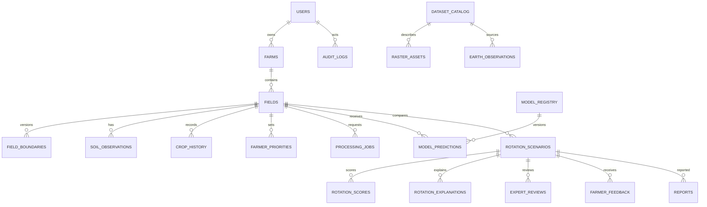

# Proposed entity relationship diagram

```mermaid
erDiagram
  USERS ||--o{ FARMS : owns
  FARMS ||--o{ FIELDS : contains
  FIELDS ||--o{ FIELD_BOUNDARIES : versions
  FIELDS ||--o{ SOIL_OBSERVATIONS : has
  FIELDS ||--o{ CROP_HISTORY : records
  FIELDS ||--o{ FARMER_PRIORITIES : sets
  DATASET_CATALOG ||--o{ RASTER_ASSETS : describes
  DATASET_CATALOG ||--o{ EARTH_OBSERVATIONS : sources
  FIELDS ||--o{ PROCESSING_JOBS : requests
  MODEL_REGISTRY ||--o{ MODEL_PREDICTIONS : versions
  FIELDS ||--o{ MODEL_PREDICTIONS : receives
  FIELDS ||--o{ ROTATION_SCENARIOS : compares
  ROTATION_SCENARIOS ||--o{ ROTATION_SCORES : scores
  ROTATION_SCENARIOS ||--o{ ROTATION_EXPLANATIONS : explains
  ROTATION_SCENARIOS ||--o{ EXPERT_REVIEWS : reviews
  ROTATION_SCENARIOS ||--o{ FARMER_FEEDBACK : receives
  ROTATION_SCENARIOS ||--o{ REPORTS : reported
  USERS ||--o{ AUDIT_LOGS : acts
```

Conceptual relationships only; authorization, cardinality, retention, and normalization require review before migration.
